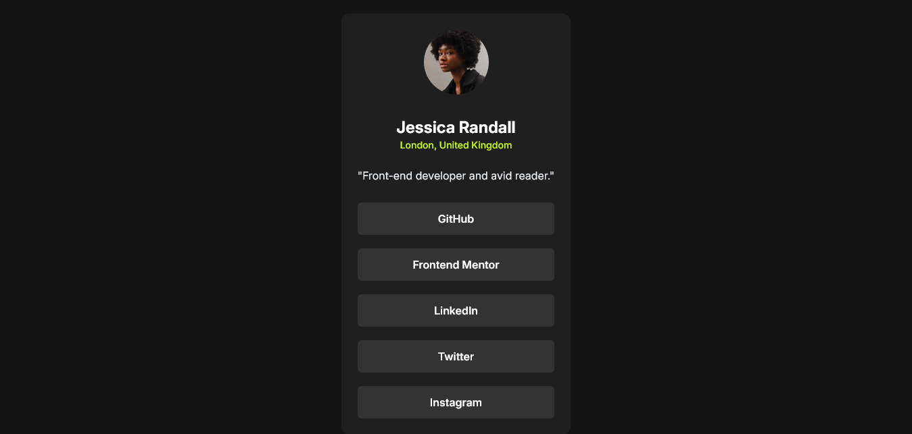

# Frontend Mentor - Social links profile solution

This is a solution to the [Social links profile challenge on Frontend Mentor](https://www.frontendmentor.io/challenges/social-links-profile-UG32l9m6dQ). Frontend Mentor challenges help you improve your coding skills by building realistic projects.

## Table of contents

- [Overview](#overview)

  - [The challenge](#the-challenge)
  - [Screenshot](#screenshot)
  - [Links](#links)

  - [Built with](#built-with)
  - [What I learned](#what-i-learned)

- [Author](#author)

## Overview

### The challenge

Users should be able to:

- See hover and focus states for all interactive elements on the page

### Screenshot



### Links

- Solution URL: [Github](https://github.com/oloude)

## My process

### Built with

- Semantic HTML5 markup
- Tailwind
- Flexbox
- CSS Grid
- Mobile-first workflow
- [React](https://reactjs.org/) - JS library
- [Typescript](https://www.typescriptlang.org/) - extends JavaScript by adding types to the language

### What I learned

Use this section to recap over some of your major learnings while working through this project. Writing these out and providing code samples of areas you want to highlight is a great way to reinforce your own knowledge.

To see how you can add code snippets, see below:

```js
function Link({ name }: LinkProps) {
  return (
    <div className="text-base text-white font-semibold bg-grey700 rounded-md py-3 text-center hover:bg-green hover:text-grey900">
      {name}
    </div>
  );
}
```

## Author

- Frontend Mentor - [@Oloude](https://www.frontendmentor.io/profile/Oloude)
- Twitter - [@AbosedeOloude](https://www.twitter.com/AbosedeOloude)
